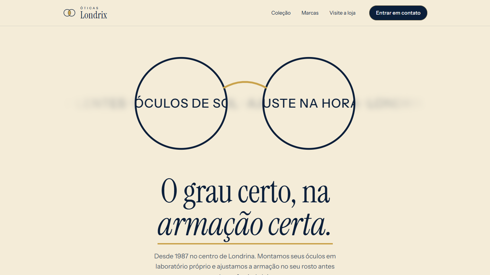

<div align="center">

# ÓTICAS LONDRIX — Experiência digital de ótica

Projeto de estudo desenvolvido em **Astro** para apresentar uma ótica por meio de uma landing page elegante, responsiva, componentizada e orientada por rolagem.

[](https://astro.build/)


### [Acessar demonstração na Vercel →](https://site-otica-omega.vercel.app)

</div>



## Visão geral

A **Óticas Londrix** é uma ótica fictícia do centro de Londrina. A landing page apresenta a loja em uma única página, com identidade em azul-marinho, creme e dourado, tipografia serifada de alto contraste e um logotipo próprio formado por duas lentes que se sobrepõem.

O projeto foi construído como exercício de desenvolvimento front-end, seção por seção: cabeçalho, hero, estilos de óculos, catálogo, marcas, coleção de inverno, visita à loja e rodapé. A página foi dividida em componentes Astro independentes, com estilos encapsulados. Todas as animações de rolagem são feitas **apenas com CSS**, sem biblioteca de animação, e o JavaScript aparece somente em três interações pontuais.

> **Aviso:** este é um projeto educacional. A Óticas Londrix, as marcas do carrossel, os produtos, o endereço, o telefone e o e-mail são fictícios. O telefone e o e-mail foram escolhidos de propósito para não existirem de verdade. Os formulários não enviam dados.

## Uso de inteligência artificial

O projeto foi desenvolvido **quase integralmente com assistência de IA generativa**, principalmente por meio do Claude Code, da Anthropic. A IA apoiou a implementação dos componentes, a criação do logotipo e do mapa em SVG, as animações de rolagem, a depuração, os testes visuais no navegador, o build e a documentação.

O repositório registra um processo de aprendizado assistido. O objetivo não é apresentar o código como integralmente escrito à mão, mas demonstrar a capacidade de definir requisitos, avaliar resultados, solicitar correções, validar comportamentos e conduzir um projeto até a publicação.

## Meu papel no processo

Minha participação concentrou-se em:

- Definir o objetivo, a paleta de cores e o estilo minimalista e elegante da página;
- Fornecer o protótipo de referência e as fotografias usadas nas seções;
- Pedir a construção seção por seção, aprovando cada etapa antes de seguir para a próxima;
- Comparar cada seção com a referência e pedir ajustes de fonte, botões, nomes de produtos e quantidade de elementos;
- Exigir que contatos e marcas fossem dados que não existem de verdade;
- Validar o comportamento no navegador, em tela grande e no celular;
- Acompanhar os builds de produção do Astro;
- Organizar a apresentação e a documentação do repositório;
- Preparar o projeto para versionamento no GitHub e deploy na Vercel.

## Projeto em números

| Entrega | Resultado |
| --- | --- |
| Páginas Astro | 1 |
| Seções da página | 8 |
| Componentes Astro | 10 |
| Layout compartilhado | 1 |
| Categorias do catálogo | 4 |
| Produtos no catálogo | 16 |
| Desenhos em SVG (armações, lentes e acessórios) | 14 |
| Fotografias integradas | 5 |
| Scripts de interação | 3 |

## Experiência da página

- Cabeçalho fixo com logotipo próprio e menu responsivo para o celular;
- Hero com texto que corre desfocado e fica nítido apenas dentro das lentes de um óculos desenhado em SVG;
- Título com palavras que entram saindo do desfoque e filete dourado que se desenha;
- Quatro telas cheias de estilos (Clássico, Moderno, Aviador e Minimal), cada uma com foto, véu azul-marinho e uma palavra cujas letras se juntam durante a rolagem;
- Telas que entram inclinadas por cima das anteriores, como páginas virando;
- Catálogo fixo na tela que troca de categoria conforme a rolagem, com abas clicáveis e produtos desenhados em SVG;
- Marquee enxuto de marcas fictícias, que pausa ao passar o mouse;
- Seção da coleção de inverno com foto revelada na rolagem, título animado e formulário de lista de espera fictício;
- Seção de visita com mapa estilizado em SVG, rota dourada que se desenha e pino com pulso suave;
- Janela de contato aberta pelos botões do site, com validação nativa e confirmação visual;
- Rodapé com navegação interna, serviços que abrem o formulário e botão de voltar ao topo;
- Botões arredondados com filete dourado, elevação no hover e seta em círculo.

## Tecnologias e ferramentas

| Tecnologia | Aplicação no projeto |
| --- | --- |
| **Astro 7** | Componentes, layout, otimização de imagens, fontes e geração do site estático |
| **HTML5** | Estrutura semântica, navegação, `<dialog>`, formulários e SVG inline |
| **CSS3** | Grid, Flexbox, `position: sticky`, `animation-timeline`, `@property`, `color-mix()` e responsividade |
| **JavaScript / TypeScript** | Menu do celular, janela de contato e formulário de lista de espera |
| **Web APIs** | `<dialog>`, `matchMedia` por CSS (`prefers-reduced-motion`) e `view-timeline` |
| **Fontes do Astro** | Instrument Sans e Instrument Serif carregadas pela API de fontes |
| **Node.js e npm** | Ambiente de desenvolvimento e gerenciamento de dependências |
| **Git e GitHub** | Versionamento e publicação do código-fonte |
| **Vercel** | Build e hospedagem da versão de produção |
| **Claude Code** | Apoio na implementação, revisão, testes visuais e documentação |

## Prática com Git e GitHub

O repositório registra a evolução do projeto e permite praticar um fluxo real de versionamento e publicação:

- Preparação apenas dos arquivos que pertencem ao projeto, deixando de fora arquivos técnicos de apoio;
- Criação da branch principal `main`;
- Mensagens de commit curtas, no padrão `feat:`, `fix:` e `docs:`;
- Publicação do código no GitHub;
- Integração entre GitHub e Vercel;
- Validação do build antes de cada deploy.

[Consultar o histórico de commits →](https://github.com/tiagolaitharth/site-otica/commits/main/)

## Organização do código

```text
src/
├── assets/
│   ├── estilos/
│   └── inverno.png
├── components/
│   ├── Cabecalho.astro
│   ├── Catalogo.astro
│   ├── ColecaoInverno.astro
│   ├── Estilos.astro
│   ├── FormularioContato.astro
│   ├── Hero.astro
│   ├── Logotipo.astro
│   ├── Marcas.astro
│   ├── Rodape.astro
│   └── Visite.astro
├── data/
│   └── catalogo.ts
├── layouts/
│   └── Layout.astro
├── pages/
│   └── index.astro
└── styles/
    └── global.css
```

O `index.astro` organiza as seções na ordem visual da página. O `Layout.astro` concentra a estrutura comum do documento e carrega as fontes. O `global.css` guarda as cores, a tipografia base e os botões compartilhados. O catálogo é alimentado por `data/catalogo.ts`, que reúne produtos, categorias e os desenhos em SVG.

## Desafios e soluções

| Desafio | Solução aplicada |
| --- | --- |
| Fazer o texto correr e ficar nítido só dentro das lentes | Duas faixas de texto sobrepostas, uma desfocada e outra recortada por `mask-image` no formato das lentes |
| Animar a rolagem sem biblioteca | `position: sticky` para empilhar telas e `animation-timeline` com linhas do tempo nomeadas |
| Trocar as categorias do catálogo sem JavaScript | Palco fixo de `400svh`, painéis com animação ligada à rolagem e abas que são âncoras posicionadas dentro da seção |
| Alinhar as faixas de rolagem com a posição real | `view-timeline-inset: 0`, porque o `scroll-padding` da página deslocava o cálculo |
| Evitar duas categorias visíveis ao mesmo tempo | Transição direta, uma categoria some enquanto a outra entra, e âncoras que pousam depois da troca |
| Não estourar o conteúdo em telas baixas | Abaixo de `40rem` de altura o catálogo vira uma lista normal, e os botões secundários só aparecem em telas maiores |
| Fotografias de cerca de 1,8 MB cada | Componente `<Image />` do Astro com WebP e três tamanhos, resultando em arquivos de 17 a 57 kB |
| Mapa sem carregar conteúdo de terceiros | Mapa estilizado em SVG, com rota desenhada por `stroke-dashoffset` e pino com pulso |
| Marquee acessível | Grupo duplicado marcado com `aria-hidden`, pausa no hover e lista em linhas para quem prefere menos movimento |
| Manter dados que não existem de verdade | Telefone fixo iniciado em 1, e-mail com domínio reservado `.example` e marcas e ruas inventadas |
| Espaço entre elementos inline sumindo no Astro | Uso explícito de `{' '}` entre palavras e trechos em itálico |

## Executar localmente

Requisitos:

- Node.js 22.12 ou superior;
- npm.

```bash
npm install
npm run dev
```

O servidor de desenvolvimento do Astro será iniciado em `http://localhost:4321`.

Para validar a versão de produção:

```bash
npm run build
npm run preview
```

## Comandos

| Comando | Ação |
| --- | --- |
| `npm run dev` | Inicia o servidor de desenvolvimento |
| `npm run build` | Gera o site estático em `dist/` |
| `npm run preview` | Exibe localmente o build de produção |
| `npm run astro -- --help` | Exibe a ajuda da CLI do Astro |

## Competências praticadas

- Desenvolvimento front-end;
- Construção de interfaces responsivas;
- Componentização com Astro;
- Animações orientadas por rolagem somente com CSS;
- Organização e manutenção de CSS;
- Criação de logotipo e ilustrações em SVG;
- Otimização de imagens e fontes;
- Acessibilidade, foco visível e suporte a `prefers-reduced-motion`;
- Versionamento com Git e GitHub;
- Preparação de projetos para deploy na Vercel;
- Definição de requisitos e condução iterativa com IA generativa;
- Avaliação crítica e refinamento de resultados produzidos por IA.

## Status e limitações

A experiência visual principal está concluída e o build de produção é gerado corretamente.

Os formulários de contato e de lista de espera representam apenas o fluxo de interface: validam no navegador, mostram uma confirmação e não enviam dados para nenhuma API. O botão “Como chegar” abre a busca do Google Maps pela cidade de Londrina, e não pelo endereço fictício. O rodapé não tem redes sociais nem páginas legais, porque não existem contas ou páginas reais correspondentes.

As animações de rolagem dependem de `animation-timeline`. Em navegadores sem esse recurso, a página continua legível e aparece já no estado final, sem as animações.

## Próximas melhorias

- Integrar os formulários a um serviço real;
- Criar páginas internas para exame de vista, serviços e convênios;
- Substituir as fotografias por imagens próprias da ótica;
- Adicionar metadados de SEO, URLs canônicas e cartões para redes sociais;
- Executar auditorias com Lighthouse;
- Adicionar testes de interface e acessibilidade.

## Sobre mim

Sou estudante do curso de **Análise e Desenvolvimento de Sistemas**, em início de carreira. Utilizo projetos práticos e ferramentas de IA para transformar o conteúdo estudado em experiências funcionais e fortalecer meus conhecimentos em desenvolvimento web.

Este projeto demonstra minha capacidade de conduzir uma ideia até uma versão publicável, aprender por meio de iterações e utilizar IA com transparência.
